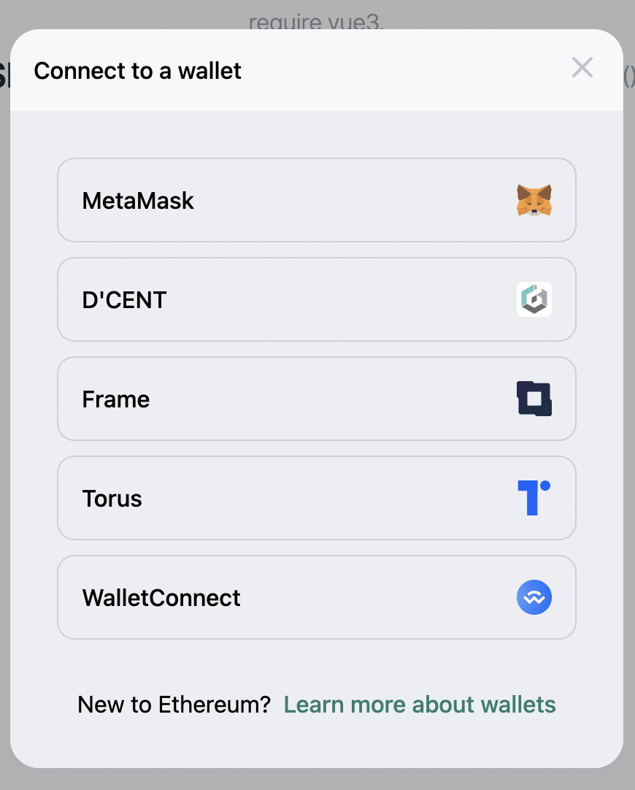
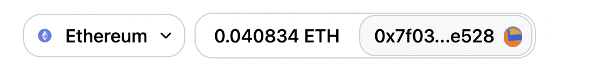

# vue3-web3modal

[](https://npmjs.com/package/vue3-web3modal) [](https://npmjs.com/package/vue3-web3modal)[](https://app.netlify.com/sites/vue3-web3modal/deploys)


# demo


View [Demo](https://vue3-web3modal.netlify.app/)
The demo works, Connect your wallet to see it in action.

> See demo folder in repo to see how its setup!

# Copied from uniswap;

This Modal is copied from this [uniswap interface](https://github.com/Uniswap/interface); as seen in the [Uniswap exchange.](https://app.uniswap.org/.)

# Installation

```bash
npm i vue3-web3modal
# or
yarn add vue3-web3modal
```

# setup

It uses [web3modal](https://github.com/Web3Modal/web3modal) beneath;
so you first have to install your desired providers;
```bash
//install desired providers

npm i Authereum  
npm i  Venly 
npm i  Portis  
npm i  Bitski
....
```

For all supported providers, see [origninal web3modal providers](https://github.com/Web3Modal/web3modal#provider-options) for more info;

# Create a providerOptions file:
The  providers options file format is the same as  [ web3modal providers](https://github.com/Web3Modal/web3modal#provider-options)
```js
// ./providerOptions.js
import Authereum from "authereum";
import { Venly } from "@venly/web3-provider";
import Portis from "@portis/web3";
import { Bitski } from "bitski";
export const providerOptions = {
    walletconnect: {
        package: WalletConnectProvider,
        options: {
            infuraId: process.env.VUE_APP_INFURA_KEY,
        },
    },
    venly: {
        package: Venly, // required
        options: {
            clientId: process.env.VUE_APP_VENLY_CLIENT_ID // required
        }
    },
    portis: {
        package: Portis, // required
        options: {
            id: process.env.VUE_APP_PORTIS_ID, // required
        },
    },
    bitski: {
    package: Bitski,
    options: {
        clientId: process.env.VUE_APP_BITSKI_CLIENT_ID,
        callbackUrl: window.location.href + "bitski-callback.html",
    },
},

```
# setup vue3

> Requires [vue-i18n](http://vue-i18n.intlify.dev/) to be in your app

Some Providers dont support events so all transactions are confirmed using infura ;

> infuraKey app key is required


````js
// in your main.js
const infuraKey = process.env.VUE_APP_INFURA_KEY;
import {providerOptions}  from './providers'
import { createApp } from 'vue';
import { createI18n } from "vue-i18n"; 
import { createWeb3 } from 'vue3-web3modal';
import App from './App.vue';
//To disable global registration , set global false
import { theme } from './theme';
import {providerOptions}  from './providers'
const web3vue = createWeb3({
    infuraKey,
    providerOptions,
    theme,
    global:true // components will be registered globally
})
const app = createApp(App);
app.use(i18n);
app.use(web3vue);
app.config.devtools = true
app.mount('#app');
````
# Using the Web3Manager
> automatically registers the modal!



```js
// import Web3Manager plugin and active web3 
<script>
import { Web3Manager, useActiveWeb3Vue} from "vue3-web3modal";
export default {
	components: {
		Web3Manager,
	},
	setup() {
        // all these variable need .value
		const { 
            web3, //ref
            account, //ref
            accountEns, //asyncComputed
            etherBalance, //asyncComputed
            chainId,//ref
            providerInfo,//computed
            isValidNetwork,//computed
            active,//ref
            error, //ref
        } = useActiveWeb3Vue();
        console.log(etherBalance.value)
		return {
            account
		};
	},
};
</script>
<template>
<Web3Manager />
</template>

```
The Web3Manager has a slot for user dropdown 

```js
<Web3Manager>
    <UserDropDown>// your user dropdwon component
</Web3Manager>
```

## using Web3Modal only, No Web3Manager

First Disable automatic registration. 
> Automatic registration disabled by default
In your main.js
````js
const web3vue = createWeb3({
    infuraKey, 
    providerOptions,
    theme,
    //global:true //remove this
})
````
In One of your Components eg App.vue

```vue
// import web menu plugin and activeweb3 
<script>
    import { Web3Modal, useActiveWeb3Vue, useWeb3ModalToggle} from "vue3-web3modal";
	export default {
	components: {
		Web3Modal,
	},
	setup() {
        // all these variable need .value
        const { 
            web3, //ref
            account, //ref
            accountEns, //asyncComputed
            etherBalance, //asyncComputed
            ...
         } = useActiveWeb3Vue();
        console.log(etherBalance.value)
        const { open, close, isOpen, toggle} = useWeb3ModalToggle();
		return {
            account,
            toggle
		};
	},
};
</script>
<template>
<Web3Modal />
<a href="#" @click="toggle()">Connect Your Wallet</a>
</template>
```

# Translations.
> Important!!!
You must initialize and enable [vue-i18n](http://vue-i18n.intlify.dev/)
The Plugin uses vuei18n for translations .
```js
{{$t('Connect Modal')}}

```
Add the following translations to your translation file:
I will appreciate any pull requests for this ...

```js
// in ./translations.js
const messages = {
    en: {
        "Account": "Account",
        "Arbiscan": "Arbiscan",
        "Arbitrum Bridge": "Arbitrum Bridge",
        "Bridge": "Bridge",
        "Bscscan": "Bscscan",
        "Change": "Change",
        "Check network status": "Check network status",
        "close": "close",
        "Connect": "Connect",
        "Connect to a wallet": "Connect to a wallet",
        "Connected with": "Connected with",
        "Copied": "Copied",
        "dashboard": "dashboard",
        "Disconnect": "Disconnect",
        "Error connecting": "Error connecting",
        "Error Connecting": "Error Connecting",
        "Error connecting. Try refreshing the page": "Error connecting. Try refreshing the page",
        "Etherscan": "Etherscan",
        "Help Center": "Help Center",
        "here.": "here.",
        "Initializing...": "Initializing...",
        "Invalid Network": "Invalid Network",
        "Network Warning": "Network Warning",
        "onDismiss": "onDismiss",
        "Optimism Gateway": "Optimism Gateway",
        "Optimistic Etherscan": "Optimistic Etherscan",
        "Pending": "Pending",
        "Polygon Bridge": "Polygon Bridge",
        "Polygonscan": "Polygonscan",
        "Select a network": "Select a network",
        "Show Portis": "Show Portis",
        "Try Again ": "Try Again ",
        "Wallet": "Wallet",
        "Wrong Network": "Wrong Network",
        "You may have lost your network connection, or {label} might be down right now.": "You may have lost your network connection, or {label} might be down right now.",
        "You may have lost your network connection.": "You may have lost your network connection.",
        "Your Wallets Network is not supported": "Your Wallets Network is not supported"
    },
    de:{
        "Account": "Konto",
        "Arbiscan": "Arbiscan",
        ....
        //etc
    }
}
```
Initialize vue-i18n
```js
//in your main.js
.....

import translations from './messages'; // translations
// 2. Create i18n instance with options
const i18n = createI18n({
    locale: 'en', // set locale
    fallbackLocale: 'en', // set fallback locale
    translations, // set locale messages
})

const app = createApp(APP);
app.use(i18n); // translations
app.use(web3vue); // initialize web3vue


```
# Usage
once the modal is enabled and permission granted by user
you can access the following variable anywhere in your app
```js
// anywhere in your app setup()
import { useActiveWeb3Vue } from "vue3-web3modal";

setup(){

    const {
        web3, //ref
        account, //ref
        accountEns, //asyncComputed
        etherBalance, //asyncComputed
        chainId,//ref
        providerInfo,//computed
        isValidNetwork,//computed
        active,//ref
        error, //ref
    } = useActiveWeb3Vue();
    //web3 is initialized;
    const contract = new web3.value.eth.Contract(your_toke_ABI, token_address);
    const balance = await contract.methods.balanceOf(account.value);
    console.log(web3.utils.fromWei(balance.toString()));
    return{
        account
        web3
        balance
    }
}

```
# web3 
`web3` is null  `ref` before initialization
after its populated with the connected web3 account
```js
import { useActiveWeb3Vue } from "vue3-web3modal";
/// in the component setup
setup(){
    const { web3, account } = useActiveWeb3Vue();
    const contract = new web3.value.eth.Contract(your_toke_ABI, token_address);
    const balance = await contract.methods.balanceOf(account.value);
    console.log(web3.utils.fromWei(balance.toString()));
    return {
        balance;
    }
}

```

# account ;
`account` is a `null`  `ref` before initialization

after user connected, is the users address;

It will be modified to new address if user changes address in wallet eg metamask
```js
import { useActiveWeb3Vue } from "vue3-web3modal";
/// in the component setup
setup(){
    const {  account   } = useActiveWeb3Vue();
    console.log(account.value);
    //0x7f0374480b9Ca09144F6cBd16774FDf1da1ae528
}
```
#  accountEns ;
`accountEns` is a null  `ref` before initialization
after user connected, is the users ensname if user registed it;
is `computed ref` and will be recomputed if user changes network or address
```js
import { useActiveWeb3Vue } from "vue3-web3modal";
/// in the component setup
setup(){
    const {  accountEns   } = useActiveWeb3Vue();
    console.log(accountEns.value);
    //zobit.eth
}
```

# etherBalance;
`etherBalance` is a `null` computed  `ref` before initialization;
After user connected, is the users etherbalance in ETH;
Is `computed ref` and will be recomputed if user changes network or address or spends or receives eth;
```js
import { useActiveWeb3Vue } from "vue3-web3modal";
/// in the component setup
setup(){
    const {  etherBalance   } = useActiveWeb3Vue();
    console.log(etherBalance.value);
    //0.054357546476767353
}
```

# chainId
`chainId` is a null   `ref` before initialization;
After user connected, is the users network chainId ;
Is a `ref` and will be adjusted automatically if user changes network;
```js
import { useActiveWeb3Vue } from "vue3-web3modal";
/// in the component setup
setup(){
    const {  chainId   } = useActiveWeb3Vue();
    console.log(chainId.value);
    // 3
}
```

# providerInfo, isValidNetwork
`providerInfo` is the information of connected provider eg metamask , coinbase etc:

`isValidNetwork` is a `boolean` `ref`, determines if user is connected to a supported network;
the follwoing networks are supported
```
MAINNET: 1,
ROPSTEN: 3,
RINKEBY: 4,
GOERLI: 5,
KOVAN: 42,
ARBITRUM_ONE: 42161,
ARBITRUM_RINKEBY: 421611,
OPTIMISM: 10,
OPTIMISTIC_KOVAN: 69,
POLYGON: 137,
POLYGON_MUMBAI: 80001,
BINANCE: 56,
BINANCE_TESTNET: 97,
```
usage

```js
import { useActiveWeb3Vue } from "vue3-web3modal";
/// in the component setup
setup(){
    const {  isValidNetwork,providerInfo   } = useActiveWeb3Vue();
    if(isValidNetwork.value){
        console(providerInfo.value)
        /*{
            name: metamask,
            .....
        }*/
    }
    // true
}
```


# active, error

`active` is a `boolean` ref, determines if user the user has connected his wallet and everything is set;

`error` is a `ref` containing and errors accounted,
you can use it to determine everythis is going ok
```js
import { useActiveWeb3Vue } from "vue3-web3modal";
import {watch} from vue;
/// in the component setup
setup(){
    const {  active , error, web3   } = useActiveWeb3Vue();
    watch([active, error], ([active, error])=>{
        if(active){
             login(); // user connected
        }else{
            logout() // user closed wallet
            console.log('deactivated')
        }
        if(error){
            showError(error);
        }
       
    })
}
```

# Transactions;
Some providers dont support events, making it tough to confirm transactions.

so to unify transactions confirmation, a method exists to confirm transactions via Infura

```js
import { useActiveWeb3Vue,  addTransaction, txBus } from "vue3-web3modal";
/// in the component setup
setup(){
    const { web3  } = useActiveWeb3Vue();
    const to = '0x7f0374480b9Ca09144F6cBd16774FDf1da1ae528';
    const contract = new web3.value.eth.Contract(your_toke_ABI, token_address);
    const amount = web3.utils.toWei('0.9675');
    const hash = await contract.methods.transfer(to, amount);
    // some providers dont support this
    //contract.methods.transfer(to, amount).once('receipt',(receipt)=>console.log(receipt))
    addTransaction({
        hash,
        onSuccess:(receipt)=>console.log(receipt), // after one confirmation
        onError:(error)=>console.log(error),
        summary:'Send 0.0967 ZBT',
        approval: false, // flag to show tx is approval tx
    })
    // or listen to tx events
    txBus.on(hash, ({receipt, error, hash, summary})=>{
        // error occured if error was set;
        if(error) return showError(error);
        console.log(receipt.hash)
    })
}
```


# events;
Again Some providers dont support events listening;

You would be wise to use infura;

> Infura doesnt support binance chain 

```js
import { useInfura } from "vue3-web3modal";
/// in the component setup
setup(){
    //websocket with fallback to https;
    const { infuraWss  } = useInfura();
    // infuraWss is a web3 instance connected to infura websockets
    infuraWss.value.eth
        .subscribe("newBlockHeaders")
        .on("data", (block) => console.log(block));
    // contracts events
    const contract = new infuraWss.value.eth.Contract(your_toke_ABI, token_address);
    contract.events.Transfer().on('data', (event)=> console.log(event))
}
```

# Theming
By default, Uniswap colors are preserved,
But we all have our themes
Adjust the colours below  to suit your needs.

> I just extracted this theme in random, I dont what color goes where so experimemt and share

```js
// in ./theme.js
import { computed, reactive } from "vue";
import { darkMode } from "../src/index";
export const theme = reactive({
    colors: null,
    // base
    white:"#FFFFFF",
    black:"#000000",
    // text
    text1: computed(() => darkMode.value ? "#FFFFFF" : "#000000"),
    text2: computed(() => darkMode.value ? "#C3C5CB" : "#565A69"),
    text3: computed(() => darkMode.value ? "#6C7284" : "#888D9B"),
    text4: computed(() => darkMode.value ? "#565A69" : "#C3C5CB"),
    // backgrounds / greys
    
    // backgrounds / greys
    bg0: computed(() => darkMode.value ? '#191B1F' : '#FFF'),
    bg1: computed(() => darkMode.value ? '#212429' : '#F7F8FA'),
    bg2: computed(() => darkMode.value ? '#2C2F36' : '#EDEEF2'),
    bg3: computed(() => darkMode.value ? '#40444F' : '#CED0D9'),
    bg4: computed(() => darkMode.value ? '#565A69' : '#888D9B'),
 
    //borders
    bd0: computed(() => darkMode.value ? '#191B1F' : '#CED0D9'),
    bd1: computed(() => darkMode.value ? '#212429' : '#CED0D9'),
    bd2: computed(() => darkMode.value ? '#2C2F36' : '#EDEEF2'),
    bd3: computed(() => darkMode.value ? '#40444F' : '#CED0D9'),

    //specialty colors
    modalBG: computed(() => darkMode.value ? "rgba(0,0,0,.425)" : "rgba(0,0,0,0.3)"),
    //primary colorsrgb(209 250 229)

    primary1: computed(() => darkMode.value ? '#2172E5' : '#1e7e6b'),
    //primary2: computed(() => darkMode.value ? '#3680E7' : '#78baad'),
    primary3: computed(() => darkMode.value ? '#4D8FEA' : '#90c3b9'),
    primary4: computed(() => darkMode.value ? '#376bad70' : '#a4d2c9'),
    primary5: computed(() => darkMode.value ? '#153d6f70' : '#c2eae2'),
    // color text

    // color text
   
    primaryText1: computed(() => darkMode.value ? '#5090ea' : '#1e7e6b'),

    // other
    red1: "#FD4040",
    green1: "#27AE60",
    yellow2: "#F3841E",
    blue1: "#a78253",
    //shadows
    shadow1: computed(() => darkMode.value ? "#000" : "#2F80ED"),
});

```
add the theme to your main.js

```js
// adjust  your main.js
const infuraKey = process.env.VUE_APP_INFURA_KEY;
import { theme } from './theme'; // see theming below
import {providerOptions}  from './providers' //we created this above
const web3vue = createWeb3({
    infuraKey, 
    providerOptions,
    theme, // add theme
})

const app = createApp(DemoApp);
app.use(i18n);
app.use(web3vue);

```
# Env Variables
if using vue-cli its recommeded to add your api keys to your `.env ` file;
in vue-cli  the `VUE_APP_` prefix ie required 
```env
// in ./.env -->these are dummies


VUE_APP_INFURA_KEY=7cd6581wth84a5e9084450a8c9a90e8j
VUE_APP_FORTMATIC_KEY=pk_live_5CYC964AFEDW4B62
VUE_APP_PORTIS_ID=01801ec8-5ec5-4070-aeff-4a955ea4bccb

....

// const infuraKey = process.env.VUE_APP_INFURA_KEY;
```
Or Laravel
The `MIX_` prefix is required
```env
// in ./.env 


MIX_INFURA_KEY=7cd6581wth84a5e9084450a8c9a90e8j
MIX_FORTMATIC_KEY=pk_live_5CYC964AFEDW4B62
MIX_PORTIS_ID=01801ec8-5ec5-4070-aeff-4a955ea4bccb

....
```
# Contributing

1. Fork it!
2. Create your feature branch: `git checkout -b my-new-feature`
3. Commit your changes: `git commit -am 'Add some feature'`
4. Push to the branch: `git push origin my-new-feature`
5. Submit a pull request :D

# Author

**vue3-web3modal** © [envatic](https://github.com/envatic), Released under the [MIT](./LICENSE) License.<br>
Authored and maintained by envatic with help from contributors ([list](https://github.com/envatic/vue3-web3modal/contributors)).

>  GitHub [@envatic](https://github.com/envatic) · Twitter [@ofumbi](https://twitter.com/ofumbi)
